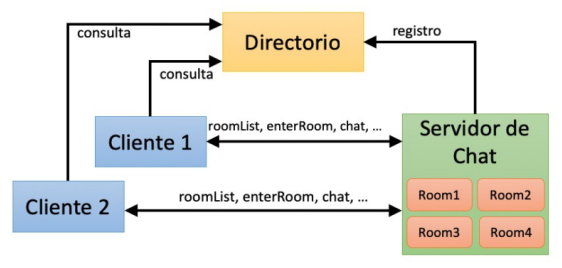
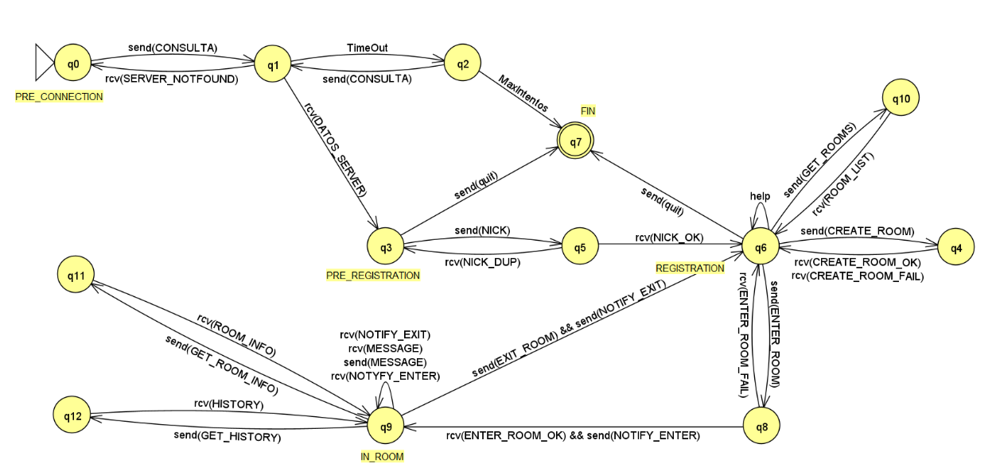
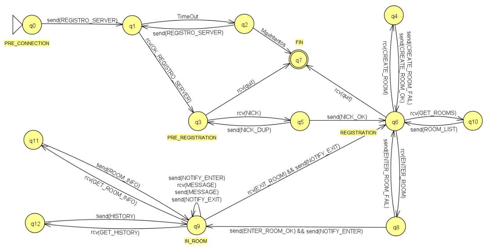
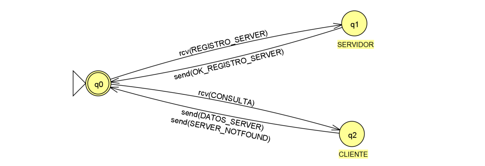
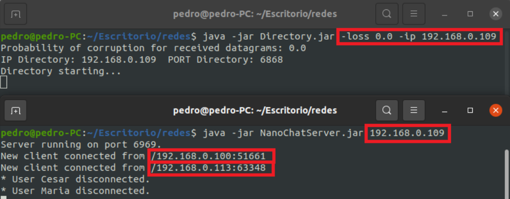
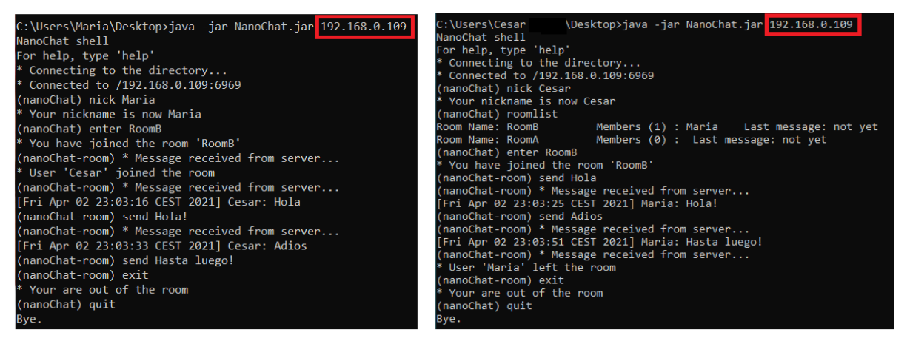

# NanoChat - Cliente/Servidor de Chat Distribuido

Aplicación desarrollada como parte de la asignatura **Redes de Comunicaciones** (Universidad de Murcia, curso 2020/2021). Permite a múltiples usuarios conectarse a salas de chat distribuidas a través de un sistema cliente-servidor, gestionado mediante un directorio central.

- [📄 Documentación completa](./doc/Memoria_Redes.pdf)

## 🧭 Propósito

**NanoChat** permite la comunicación entre múltiples clientes conectados a un servidor de chat. El acceso se realiza a través de una entidad denominada **directorio**, que permite registrar y consultar servidores disponibles.

La aplicación combina **UDP** para la comunicación entre el servidor-directorio y **TCP** entre el cliente-servidor. Ambos con un **lenguaje de marcas personalizado** para la comunicación.

## 📱 Funcionalidades

### Básicas

- Registro de servidores de chat en el directorio (UDP).
- Consulta de servidores disponibles por parte de los clientes (UDP).
- Registro de usuarios mediante nick.
- Acceso a salas de chat existentes.
- Creación de nuevas salas si no existen.
- Envío y recepción de mensajes en tiempo real.
- Comandos de ayuda e información.
- Desconexión segura.

### Mejoras implementadas

- **Notificaciones de entrada/salida** de usuarios en tiempo real.
- **Visualización del historial de mensajes** en cada sala.
- **Creación dinámica de salas** por los usuarios.
- **Eliminación automática de salas vacías**.
- **Gestión robusta de errores y desconexiones**.
- **Ejecución distribuida real** usando interfaces IP configurables.

## 📡 Arquitectura del sistema

- **Directorio (UDP):** gestiona el registro y consulta de servidores.
- **Servidor de chat (TCP):** gestiona las salas, usuarios y mensajes.
- **Cliente (TCP):** interfaz de línea de comandos para conectarse y comunicarse.



## 📑 Protocolos utilizados

### UDP (cliente/servidor ↔ directorio)

- **Registro de servidor:**  
  El servidor de chat envía al directorio un mensaje para registrarse como disponible.  
  **Formato:**

  ```
  OPCODE (1 byte) | PUERTO (4 bytes) | PROTOCOLO (1 byte)
  ```

  - `OPCODE_REGISTRO_SERVER = 1`
  - Ejemplo: `1 | 6969 | 72`

- **Confirmación de registro:**  
  El directorio responde al servidor confirmando el registro.  
  **Formato:**

  ```
  OPCODE (1 byte)
  ```

  - `OPCODE_OK_REGISTRO_SERVER = 2`
  - Ejemplo: `2`

- **Consulta de cliente:**  
  El cliente consulta al directorio por un servidor disponible para un protocolo.  
  **Formato:**

  ```
  OPCODE (1 byte) | PROTOCOLO (1 byte)
  ```

  - `OPCODE_CONSULTA = 3`
  - Ejemplo: `3 | 72`

- **Respuesta con datos del servidor:**  
  El directorio envía al cliente la IP y puerto del servidor disponible.  
  **Formato:**

  ```
  OPCODE (1 byte) | IP (4 bytes) | PUERTO (4 bytes)
  ```

  - `OPCODE_DATOS_SERVER = 4`
  - Ejemplo: `4 | 127.0.0.1 | 6969`

- **Servidor no disponible:**  
  El directorio informa al cliente que no hay servidor para el protocolo solicitado.  
  **Formato:**
  ```
  OPCODE (1 byte)
  ```
  - `OPCODE_SERVER_NOTFOUND = 5`
  - Ejemplo: `5`

---

### TCP (cliente ↔ servidor de chat)

La comunicación se realiza mediante mensajes en formato XML personalizado.

**Ejemplo de mensaje:**

```xml
<message>
  <operation>OP_CODE</operation>
</message>
```

Donde `OP_CODE` representa la acción solicitada o confirmada.

**Principales códigos de operación:**

- `OP_NICK_OK`: Registro de nick correcto.
- `OP_NICK_DUP`: Nick ya registrado.
- `OP_GET_ROOMS`: Solicitud de salas disponibles.
- `OP_ENTER_ROOM_OK`: Acceso a sala correcto.
- `OP_ENTER_ROOM_FAIL`: Error al acceder a sala.
- `OP_CREATE_ROOM_OK`: Sala creada con éxito.
- `OP_CREATE_ROOM_FAIL`: Error al crear sala.
- `OP_GET_ROOM_INFO`: Solicitud de información de sala.
- `OP_GET_HISTORY`: Solicitud de historial de mensajes.

Otros mensajes incluyen entrada/salida de sala, envío de mensajes y notificaciones.

## 🧩 Autómatas

A continuación se muestran los autómatas de protocolo que describen el comportamiento de cada componente principal del sistema:

- **Cliente:**

  

- **Servidor:**

  

- **Directorio:**

  

## 🧱 Estructura general del proyecto

```
nanoChatStudents/
└── src/
    └── es/um/redes/nanoChat/
        ├── client/           # Cliente: lógica de aplicación
        │   ├── aplication/   # Arranque y controlador principal del cliente
        │   ├── shell/        # Interfaz de línea de comandos (NCShell, comandos)
        │   └── comm/         # Comunicación cliente-servidor
        ├── directory/        # Directorio UDP
        │   ├── connector/    # Cliente del directorio
        │   └── server/       # Servidor del directorio
        ├── messageML/        # Mensajes TCP en lenguaje de marcas (XML-like)
        └── server/           # Servidor de chat
            └── roomManager/  # Gestión de salas y usuarios
```

## 🗃️ Patrones y diseño

- **Thread-per-client:** cada cliente es gestionado en un hilo propio.
- **Fachada:** `NCController` centraliza la lógica de cliente.
- **Observer:** los usuarios reciben eventos de la sala.
- **Factory:** para creación de mensajes según su tipo.
- **Singleton:** usado para el gestor de salas.
- **Buena gestión de excepciones:** manejo de desconexiones forzadas y errores de red.

## 🧪 Ejecución del proyecto

**Requisitos:**

- Java instalado en todos los dispositivos.
- `.jar` exportados para cada módulo: `Directory.jar`, `NanoChatServer.jar`, `NanoChatClient.jar`.

### Ejecución distribuida

1. **Directorio**
   ```bash
   java -jar Directory.jar -loss 0.0 -ip 192.168.0.109
   ```
2. **Servidor de Chat**
   ```bash
   java -jar NanoChatServer.jar 192.168.0.109
   ```
3. **Cliente**
   ```bash
   java -jar NanoChatClient.jar 192.168.0.109
   ```
   Sustituye `192.168.0.109` por la IP del equipo que actúe como directorio.

### ⌨️ Comandos de cliente

| Comando          | Descripción                              |
| ---------------- | ---------------------------------------- |
| `nick <nombre>`  | Registrarse con un nick                  |
| `roomlist`       | Ver salas disponibles                    |
| `enter <sala>`   | Entrar a una sala (la crea si no existe) |
| `create <sala>`  | Crear una nueva sala                     |
| `send <mensaje>` | Enviar un mensaje a la sala actual       |
| `exit`           | Salir de la sala actual                  |
| `history`        | Mostrar historial de mensajes de la sala |
| `help`           | Ver comandos disponibles                 |
| `quit`           | Desconectarse del servidor               |

### 🎬 Demo





## 👨‍💻 Autor

Pedro Nicolás Gomariz - pedro.nicolasg@um.es

Proyecto desarrollado como entrega final de la asignatura Redes de Comunicaciones - Universidad de Murcia (curso 2020/2021).

© 2021 Pedro Nicolás Gomariz. Todos los derechos reservados.
